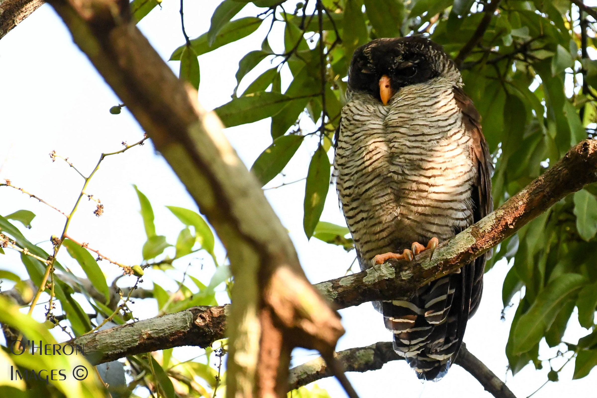
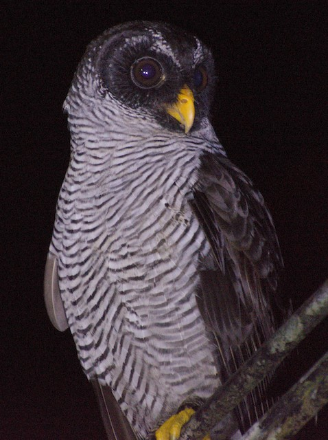
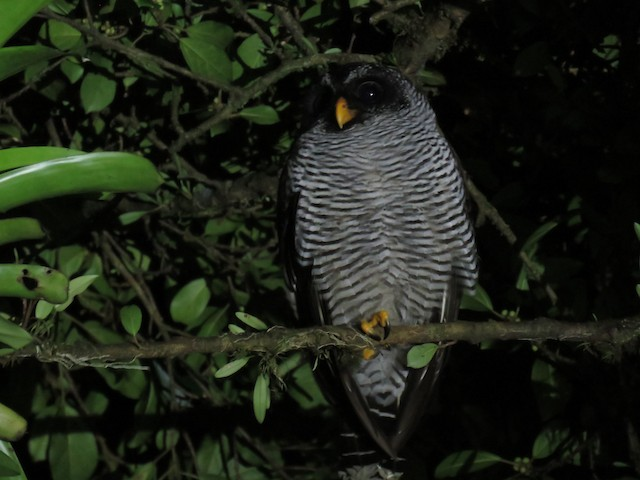
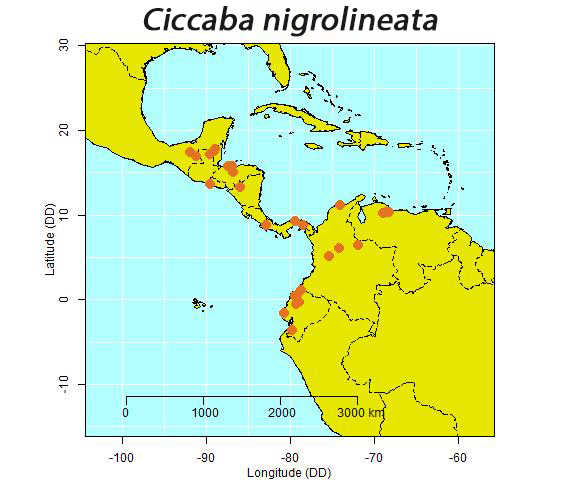
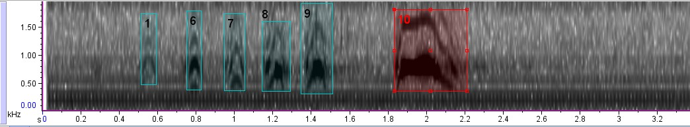
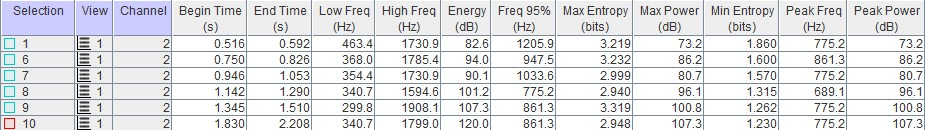
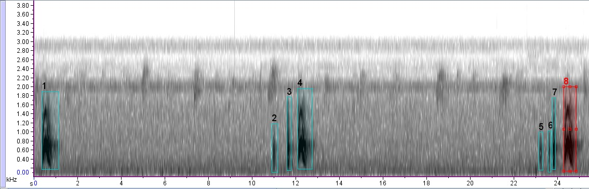
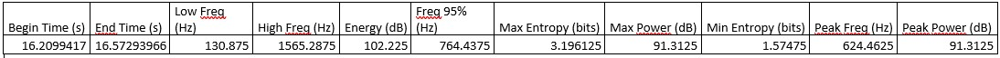

Es la única lechiza en el país que tiene barreteado negro y blanco en las partes inferiores. 
Es bastante común en zonas de tierras bajas y húmedas y raras de ver en bosques secos y elevaciones intermedias (aprox. 1500 m.s.n.m).
Suelen cazar en bordes de bosque y jardines, a menudo cerca de los postes de luz.
Esta especie duerme en los niveles bajos y medios de los árboles. 
Garrigues, R. & Dean, R. (2017). Aves de Costa Rica. Guía de campo. A Zona Tropical Publications. Cornell University Press. 

\
\

{width=150px} {width=150px} {width=150px}

\
\
\

Mapa de distribución

\
\

\
\

Espectrograma y métricas del canto de Ciccaba nigrolineata

\
\

\
\

\
\

Espectrograma y métricas de la llamada de Ciccaba nigrolineata

\
\

\
\

