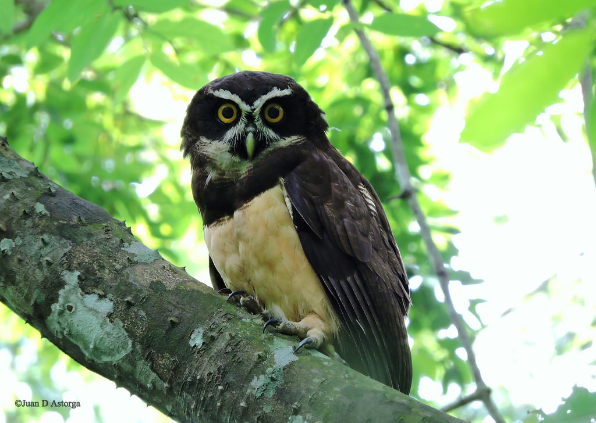

#Búhos y Lechuzas

Estas aves se caracterizan por sus cuerpos fornidos, cabezas redondas, discos faciales circulares y grandes ojos que miran hacia el frente. Todas las especies del país (Costa Rica) tienen colas cortas y colores crípticos en tonalidades cafés, con patrones moteados y listados. Son rapaces nocturnas y reconocidas por su habilidad para cazar por el sonido y la vista. Su identificación se basa en el reconocimiento de vocalizaciones.
Su dieta está basada principalmente en invertebrados y pequeños vertebrados, y algunas especies de peces.
Anidan en huecos en los troncos, rocas y nidos en los árboles. 
Existen 120 especies alrededor del mundo, con excepción del antártico.
Garrigues, R. & Dean, R. (2017). Aves de Costa Rica. Guía de campo. A Zona Tropical Publications. Cornell University Press. 

 